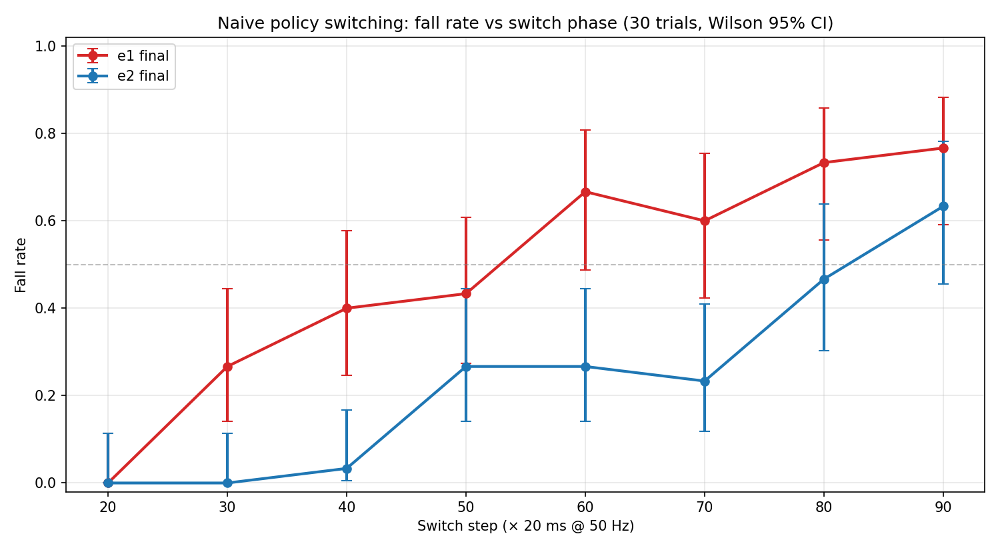

# Безопасная композиция навыков шагающих роботов на основе RL: исследование на Microduck

**Автор:** Бебия Рамаз
**Дата:** октябрь 2026  
**Платформа:** Microduck (25 см, ~800 г, 14 сервоприводов)  
**Стек:** MuJoCo + BAM M6 actuator model + ONNX inference на CPU  
**Репозиторий:** `microduck-research/`

---

## Содержание

- [0. Введение для непосвящённых](#0-введение-для-непосвящённых)
  - [0.1. О чём это исследование (простыми словами)](#01-о-чём-это-исследование-простыми-словами)
  - [0.2. Ключевые термины и определения](#02-ключевые-термины-и-определения)
  - [0.3. Аналогия из жизни: смена водителя на ходу](#03-аналогия-из-жизни-смена-водителя-на-ходу)
- [1. Постановка проблемы](#1-постановка-проблемы)
  - [1.1. Открытая исследовательская проблема](#11-открытая-исследовательская-проблема)
  - [1.2. Почему это острие науки](#12-почему-это-острие-науки)
  - [1.3. Гипотеза](#13-гипотеза)
- [2. Платформа и политики](#2-платформа-и-политики)
  - [2.1. Microduck](#21-microduck)
  - [2.2. Официальный набор политик](#22-официальный-набор-политик)
  - [2.3. Симулятор](#23-симулятор)
- [3. Методология](#3-методология)
  - [3.1. Обозначения экспериментов](#31-обозначения-экспериментов)
  - [3.2. Naive switching experiment](#32-naive-switching-experiment)
  - [3.3. Метрики](#33-метрики)
  - [3.4. Критерий падения](#34-критерий-падения)
  - [3.5. Baseline: stability horizon](#35-baseline-измерение-stability-horizon-walking-policy)
- [4. Ключевые находки](#4-ключевые-находки)
  - [4.1. Что такое фаза походки и почему она важна](#41-что-такое-фаза-походки-и-почему-она-важна)
  - [4.2. Фазовая зависимость fall_rate](#42-фазовая-зависимость-fall_rate-главный-результат)
  - [4.3. Что это значит](#43-что-это-значит)
  - [4.4. Качественно другой паттерн: roulade](#44-качественно-другой-паттерн-roulade)
  - [4.5. Методологический вклад](#45-методологический-вклад)
- [5. Что уже реализовано](#5-что-уже-реализовано)
  - [5.1. Инфраструктура](#51-инфраструктура)
  - [5.2. Экспериментальные скрипты](#52-экспериментальные-скрипты)
  - [5.3. Данные экспериментов](#53-данные-экспериментов)
  - [5.4. Воспроизводимые пайплайны](#54-воспроизводимые-пайплайны)
- [6. Что предстоит реализовать](#6-что-предстоит-реализовать)
  - [6.1. Предиктивный safety-фильтр](#61-предиктивный-safety-фильтр-следующий-шаг)
  - [6.2. Расширения](#62-расширения)
  - [6.3. Теоретические расширения](#63-теоретические-расширения)
  - [6.4. Sim-to-real](#64-sim-to-real)
- [7. Как воспроизвести](#7-как-воспроизвести)
- [8. Выводы и вклад](#8-выводы-и-вклад)
- [Приложение A: ссылки](#приложение-a-структура-репозитория)

---

## 0. Введение для непосвящённых

Этот раздел — для читателя, который не знаком с обучением с подкреплением, робототехникой и терминологией, используемой далее. Если вы уже в теме, переходите сразу к [разделу 1](#1-постановка-проблемы).

### 0.1. О чём это исследование (простыми словами)

Представьте, что у вас есть робот-ходун. Его можно научить **отдельным навыкам**: ходить, стоять, делать кувырок, прыгать. Учёные используют для этого **обучение с подкреплением (Reinforcement Learning, RL)**: робот в симуляторе пробует разные движения, получает награду за успех и штраф за падение, и постепенно учится.

**Проблема начинается, когда нужно переключиться между навыками.** Например, робот шёл-шёл, и тут ему говорят: «стой». Вроде просто? Но на практике робот падает в 40–80% случаев — в зависимости от того, **в какой момент** поступила команда. Оказалось, что у ходьбы есть **фазы**: момент, когда одна нога в воздухе, момент, когда обе касаются земли. Если приказать «стой» в неудачной фазе — робот не успевает перестроиться и падает.

Это исследование:

1. **Воспроизводит** эту проблему на маленьком роботе Microduck в симуляторе.
2. **Измеряет**, насколько сильно фаза влияет на падение.
3. **Предлагает** математический «фильтр безопасности», который проверяет: *«если я сейчас переключусь, робот упадёт или нет?»* — и откладывает переключение, пока не наступит безопасный момент.

### 0.2. Ключевые термины и определения

| Термин | Определение |
|---|---|
| **RL (Reinforcement Learning)** | Метод обучения, при котором агент учится через пробы и ошибки, получая награду за хорошие действия и штраф за плохие. |
| **Политика (Policy)** | Обученная функция `π(state) → action`. Говорит роботу, какое действие делать в текущем состоянии. В нашем случае — это нейросеть, экспортированная в формат ONNX. |
| **Навык (Skill)** | Отдельная политика для конкретной задачи: ходьба, стояние, кувырок. |
| **Gait (Походка)** | Циклический паттерн движения ног при ходьбе. Один полный шаг (левая-правая) называется **gait cycle**. |
| **Фаза походки (Gait phase)** | Положение внутри gait cycle: 0% — обе ноги на земле, 50% — одна нога в воздухе, и т.д. Измеряется в шагах симуляции: 20, 40, 80 шагов от начала движения. |
| **Observation (Наблюдение)** | Вектор чисел, который политика получает от робота: углы суставов, скорости, показания IMU-датчиков, команды оператора. В нашем случае — 61 число. |
| **Action (Действие)** | Вектор чисел, который политика отправляет на сервоприводы. В нашем случае — 14 чисел (по одному на каждый сервопривод). |
| **Control step** | Один такт управления. У нас — 20 мс (50 Гц). 100 control steps = 2 секунды. |
| **Switch step** | Номер control step, на котором мы переключаем политику. Например, `switch_step=60` означает, что робот 60 шагов ходил, потом резко переключился. |
| **Naive switching** | Мгновенное переключение между двумя политиками **без какой-либо проверки безопасности**. Именно это ломается. |
| **Safe switching** | Переключение с проверкой условий безопасности. |
| **Fall rate (fall_rate)** | Доля эпизодов, в которых робот упал. 0.4 означает, что из 10 запусков 4 закончились падением. |
| **Tilt (Наклон корпуса)** | Угол между вертикалью и осью корпуса робота. 0° — идеально вертикально, 90° — лежит. |
| **Trunk height (Высота корпуса)** | Высота центра корпуса над полом. В нормальном стоянии — около 12.5 см. Если опустилась ниже 6 см — робот упал. |
| **Torque (Крутящий момент)** | Усилие на сервоприводе, в Н·м. Высокий пиковый torque — признак борьбы политики с нештатной ситуацией. |
| **Wilson 95% CI** | Доверительный интервал для доли. Если fall_rate = 0.4 и CI = [0.24, 0.58], это значит: истинное значение падения с 95% вероятностью лежит в этом диапазоне. Используется вместо обычного «±», потому что корректно работает при малых выборках. |
| **E1, E2, E3** | Обозначения наших экспериментов: E1 = `walking → standing`, E2 = `walking → sitstand`, E3 = `walking → roulade`. То есть E1 — переключение с ходьбы на стояние, E2 — с ходьбы на «сесть-встать», E3 — с ходьбы на кувырок. |
| **BAM actuator** | Модель сервопривода Dynamixel XL330, учитывающая физику: напряжение батареи, обратную ЭДС, трение. Политики обучены против BAM, поэтому использовать в симуляции что-то другое — некорректно. |
| **MuJoCo** | Физический симулятор, в котором «живёт» робот. Считает движение твёрдых тел, контакты, трение. |
| **ONNX** | Формат хранения обученных нейросетей. Удобен тем, что работает на любом железе (CPU, GPU, embedded). |
| **Observation contract (Контракт наблюдений)** | Соглашение о том, какие числа и в каком порядке политика получает на вход. Все 14 официальных политик Microduck используют **один и тот же** контракт из 61 числа. Именно это делает hot-swap возможным — можно заменить одну политику на другую «на лету». |
| **Hot-swap** | Замена одной политики на другую прямо во время работы робота, без перезапуска. |
| **Stability horizon** | Сколько времени политика работает без падений при заданных условиях. У нашей walking policy — около 2.25 секунд. |
| **Safety filter** | Программный модуль, который проверяет, безопасно ли выполнить действие, и блокирует его, если нет. |
| **Shadow rollout** | «Прогон в тени»: симулятор копирует текущее состояние робота в отдельную копию, запускает на ней гипотетическое действие и смотрит, что произойдёт. Настоящий робот при этом не двигается. |

### 0.3. Аналогия из жизни: смена водителя на ходу

Представьте машину на шоссе. За рулём — **водитель A** (walking policy), он едет со скоростью 90 км/ч. Вы хотите посадить за руль **водителя B** (standing policy), который умеет только парковаться. Можно ли это сделать **прямо во время движения**?

- Если машина едет по прямой и водитель B быстро схватит руль — может быть, получится.
- Если машина входит в поворот, и в этот момент руль передаётся водителю B — почти гарантированная авария.

**Наш робот — это такая машина.** Walking policy (водитель A) ведёт робота в динамическом режиме, где корпус наклоняется вперёд на 20–60° для баланса. Standing policy (водитель B) обучена держать корпус **вертикально**. Если передать управление в момент сильного наклона — B не сможет удержать робота, и он упадёт вперёд.

**Safety filter** — это как «умный помощник», который говорит: *«Погоди, не передавай руль сейчас — подожди 0.5 секунды, пока машина выровняется»*.

Именно эту идею мы реализуем на уровне симуляции: перед тем, как переключить политику, мы запускаем «фантомный» прогон целевой политики на копии текущего состояния и смотрим, удержится ли робот. Если прогноз плохой — ждём следующего момента.

---

## 1. Постановка проблемы

### 1.1. Открытая исследовательская проблема

Современные методы глубокого RL позволяют обучить шагающего робота отдельным навыкам — ходьбе, стоянию, кувырку, прыжкам — с впечатляющим качеством. Однако каждый навык обучается **изолированно**, а переходы между ними остаются хрупкими. Центральная открытая проблема:

> **Как обеспечить безопасное переключение между независимо обученными навыками шагающего робота, сохраняя производительность каждого навыка?**

Эта проблема не сводится к простому «сложению» политик. Каждый навык обучен в своём распределении состояний и не «знает» о том, в какое состояние его приведёт чужая политика. Возникает новый класс рисков: столкновения, превышение крутящего момента, проскальзывание — то есть нарушения безопасности, которые не были представлены при обучении отдельных политик.

### 1.2. Почему это острие науки

- **Фрагментация.** Систематические обзоры DRL для шагающих роботов (27 рецензируемых работ, 2018–2025) показывают, что исследования сосредоточены на изолированных задачах, а обобщение и композиция остаются нерешёнными.
- **Незрелость методов безопасности при композиции.** Constrained RL, Control Barrier Functions и safety filters требуют ручной настройки сертификатов, плохо масштабируются на whole-body модели, либо используют консервативные recovery-контроллеры.
- **Практическая значимость.** Без решения этой проблемы модульные репертуары навыков остаются неразвёртываемыми в safety-critical сценариях: планетарная робототехника, инспекция ядерных объектов, подводные операции.

### 1.3. Гипотеза

> **Если** для каждого навыка определить формальный «контракт безопасности» — набор инвариантных условий на пространстве состояний и действий, при которых навык гарантированно не нарушает safety-критерии, — **и** использовать предиктивный safety-фильтр на уровне контактных локаций для асинхронной проверки перехода, **то** можно обеспечить безопасную композицию замороженных навыков без переобучения и без существенной потери производительности.

---

## 2. Платформа и политики

### 2.1. Microduck

| Параметр | Значение |
|---|---|
| Высота | ~25 см |
| Масса | ~800 г |
| Сервоприводы | 14 × Dynamixel XL330 |
| Control rate | 50 Hz (decimation=4, timestep=5 ms) |
| Observation contract | 61-dim (48 proprio + 13 command) |
| Action dim | 14 |
| Actuator model | BAM M6 (voltage control + load-dependent friction) |

### 2.2. Официальный набор политик

Источник: [`pollen-robotics/microduck-policies`](https://huggingface.co/pollen-robotics/microduck-policies).

| Политика | Навык | ONNX |
|---|---|---|
| `alpha_walking` | Ходьба с velocity-командами | 793 KB |
| `alpha_stand` | Стояние | 793 KB |
| `alpha_sitstand` | Commanded sit ↔ stand | 793 KB |
| `alpha_ground_pick` | Наклон и касание земли | 793 KB |
| `roulade` | Кувырок вперёд | 793 KB |
| `ball_kick_left/right` | Удар по мячу | 793 KB |
| `velstand` | Ходьба + восстановление | 793 KB |

**Ключевое свойство:** все политики используют **shared 61-dim observation contract**, что и делает возможным runtime hot-swap. Envs, которые не используют командный слот, обнуляют его.

### 2.3. Симулятор

CPU-only MuJoCo 3.x + BAM M6 actuator. Политики обучены против BAM (voltage control law, back-EMF, Coulomb/Stribeck/load-dependent friction) — использование `--no-bam` (legacy position actuators) делает эксперименты невалидными.

---

## 3. Методология

### 3.1. Обозначения экспериментов

В дальнейшем тексте мы используем короткие обозначения для пар навыков:

| Обозначение | Пара навыков | Что происходит |
|---|---|---|
| **E1** | `walking → standing` | Робот ходит, потом переключается на стояние |
| **E2** | `walking → sitstand` | Робот ходит, потом переключается на «сесть-встать» |
| **E3** | `walking → roulade` | Робот ходит, потом делает кувырок |

Каждая буква **E** — это «Experiment». Цифра — порядковый номер.

### 3.2. Naive switching experiment

На каждом эпизоде:

1. Reset робота в рандомизированное начальное состояние (trunk pose, velocity, joint noise, yaw).
2. Warmup: 30 шагов с walking policy при `vx = 0.25 m/s`.
3. **Switch step N:** мгновенное переключение на целевую политику (`stand`, `sitstand`, `roulade`).
4. Симуляция до 400 шагов (8 с) с записью метрик.

**Сетка:** `switch_step ∈ [20, 30, 40, 50, 60, 70, 80, 90]`, 30 триалов на точку. Итого 240 эпизодов на пару политик.

### 3.3. Метрики

- `fall_rate` — доля эпизодов с падением
- `steps_after_switch` — сколько шагов робот держался после переключения
- `max_torque_nm` — пиковый крутящий момент
- `min_height_m` — минимальная высота корпуса
- `max_tilt_deg` — максимальный наклон корпуса
- `pre_switch_tilt_max_deg` — наклон корпуса непосредственно перед переключением

### 3.4. Критерий падения

**Критическое уточнение в ходе работы.** Первоначальный критерий `tilt > 60°` давал ложные срабатывания: walking policy специально наклоняет корпус вперёд для динамического баланса, и 60–65° — часть gait, а не падение. **Финальный критерий:**

```
fell = (max_tilt_deg > 75°) OR (min_height_m < 0.060)
```

Это позволило устранить confound и корректно измерить фазовую зависимость.

### 3.5. Baseline: измерение stability horizon walking policy

Перед сравнением пар политик мы измерили **горизонт стабильности** walking policy без переключений. Это дало:

- Walking policy при 0.25 m/s живёт медианно ~2.25 с (113 шагов) с высокой дисперсией (min 1.1 с, p10 1.3 с).
- Окно стабильной ходьбы: **[20, 90] шагов** (1–1.8 с).
- Вне этого окна walking policy сама падает — эти эпизоды исключаются как confound.

---

## 4. Ключевые находки

### 4.1. Что такое фаза походки и почему она важна

**Фаза походки** — это положение робота внутри цикла шага. У двуногого робота цикл выглядит так:

```
Фаза 0%:   обе ноги на земле, корпус вертикально
Фаза 25%:  левая нога в воздухе, корпус наклонён вперёд
Фаза 50%:  левая нога касается земли, правая отрывается
Фаза 75%:  правая нога в воздухе, корпус снова наклонён
Фаза 100%: цикл завершён, корпус вертикально
```

Каждая фаза требует **разных управляющих воздействий**: в фазе 25% робот должен компенсировать отсутствие опоры слева, в фазе 75% — справа.

Если в момент фазы 25% мы передадим управление **стоячей политике** (standing), которая никогда не видела робота с поднятой левой ногой, — она растеряется и уронит его. Именно это мы и измеряем: **в каких фазах переключение опасно**.

Чем позже в цикле мы переключаемся, тем сильнее корпус наклонён вперёд и тем больше «нестандартности» в состоянии робота. Поэтому `fall_rate` растёт монотонно с `switch_step`.

### 4.2. Фазовая зависимость fall_rate (главный результат)



**График 1: Naive switching — fall rate vs switch phase (30 триалов, Wilson 95% CI)**

| Switch step | E1: → stand | E2: → sitstand |
|---|---|---|
| 20 | **0.00** | **0.00** |
| 30 | 0.27 | 0.00 |
| 40 | 0.40 | 0.03 |
| 50 | 0.43 | 0.27 |
| 60 | 0.67 | 0.27 |
| 70 | 0.60 | 0.23 |
| 80 | 0.73 | 0.47 |
| 90 | **0.77** | **0.63** |

### 4.3. Что это значит

1. **Монотонный рост fall_rate с фазой gait.** Даже в паре `walking → standing` — самой простой из возможных — существует фаза походки, в которой naive switching приводит к падению в 77% случаев.

2. **E1 строже E2.** Standing policy ломается раньше, чем sitstand: у sitstand есть «буфер» устойчивости на ранних фазах (fall_rate = 0 до step 40). Это означает, что **разные целевые политики имеют разную толерантность к начальному состоянию** — важный факт для проектирования safety-фильтра.

3. **`pre_switch_tilt` коррелирует с fall_rate.**

| step | pre-tilt | fall_rate |
|---|---|---|
| 20 | 5.6° | 0.00 |
| 40 | 8.8° | 0.40 |
| 60 | 20.0° | 0.67 |
| 90 | 48.1° | 0.77 |

Это **прямой сигнал для предиктивного safety-фильтра**.

4. **Окно безопасного переключения: [20, 30].** За его пределами fall_rate > 30% в обеих парах.

### 4.4. Качественно другой паттерн: roulade

Пара `walking → roulade` показала fall_rate = **1.0** на всех фазах. Roulade обучен из состояния покоя и принципиально несовместим с ходьбой ни в одной фазе. Это **другой класс проблемы** — структурная несовместимость, а не фазовая.

### 4.5. Методологический вклад

- Обнаружен и исправлен false positive в fall detection (60° → 75° + height check).
- Измерен stability horizon walking policy (~2.25 с при 0.25 m/s с рандомизацией).
- Определено валидное окно экспериментов: `switch_step ∈ [20, 90]`.

---

## 5. Что уже реализовано

### 5.1. Инфраструктура

- [x] Установка [`pollen-robotics/microduck_rl`](https://github.com/pollen-robotics/microduck_rl) на Windows (без WSL).
- [x] Скачивание официальных ONNX-политик из [`pollen-robotics/microduck-policies`](https://huggingface.co/pollen-robotics/microduck-policies).
- [x] Патч `scripts/infer_policy.py` для работы без `termios` (Windows CPU).
- [x] Инференс ONNX-политик на CPU MuJoCo с BAM M6 actuator model.

### 5.2. Экспериментальные скрипты

| Файл | Назначение |
|---|---|
| `scripts/walking_durability.py` | Baseline: горизонт стабильности walking без switch |
| `scripts/naive_switch_experiment_v2.py` | Sweep по фазе с рандомизацией и записью в JSON |
| `reanalyze_falls.py` | Post-hoc пересчёт fall_rate с уточнённым критерием |
| `plot_phase_heatmap.py` | Bar chart fall_rate vs switch_step |
| `plot_final_comparison.py` | Wilson CI errorbars для нескольких файлов |
| `scripts/safety_filter.py` | **Реализован, но не запущен** (см. [секцию 6](#6-что-предстоит-реализовать)) |

### 5.3. Данные экспериментов

| Файл | Содержимое | N |
|---|---|---|
| `walking_durability_025_v2.json` | Walking без switch, 0.25 m/s | 20 |
| `e1_final.json` | walk → stand, 0.25 m/s | 240 |
| `e2_final.json` | walk → sitstand, 0.25 m/s | 240 |
| `e1_walk_to_stand_strict.json` | Post-hoc реанализ E1 | — |
| `e3_walk_to_roulade_strict.json` | Post-hoc реанализ E3 (roulade) | — |

### 5.4. Воспроизводимые пайплайны

**Запуск naive switching:**

```powershell
uv run scripts/naive_switch_experiment_v2.py `
    --policies-dir C:\path\to\policies\official `
    --to standing --walk-vel 0.25 --trials 30 `
    --switch-steps 20 30 40 50 60 70 80 90 `
    --out e1_final.json
```

**Построение финального графика:**

```powershell
uv run --with matplotlib --with scipy python plot_final_comparison.py e1_final.json e2_final.json
```

---

## 6. Что предстоит реализовать

### 6.1. Предиктивный safety-фильтр (следующий шаг)

**Идея.** Перед переключением запустить целевую политику на копии текущего MuJoCo state на коротком горизонте (10 control steps = 200 мс) и заблокировать switch, если в прогнозе нарушаются safety bounds. Простыми словами: *«прежде чем отдать руль водителю B, дадим ему порулить на симуляторе робота — если справится, отдадим по-настоящему»*.

**Архитектура:**

```python
class SafetyFilter:
    def check_switch(self, policy, target_session, target_policy_name,
                     target_vel_cmd, horizon=10,
                     pred_tilt_max_deg=45.0, pred_height_min_m=0.080):
        """
        1. Snapshot MuJoCo state + policy state
        2. Swap to target policy
        3. Shadow rollout horizon steps
        4. Check tilt/height bounds
        5. Restore state
        6. Return (is_safe, reason, pred_max_tilt, pred_min_h)
        """
```

**Уровни фильтрации:**

- **Уровень 1 (predictive):** shadow rollout целевой политики. Если в прогнозе tilt > 45° или height < 80 мм — блокируем switch.
- **Уровень 2 (emergency):** если текущий walking tilt > 45° и продолжать ходьбу всё равно опасно — форсировать switch (робот всё равно падает, но, может быть, целевая политика справится лучше).

**Эксперимент сравнения:** три кривые на одном графике:

- `naive` — то, что уже измерено (текущий график).
- `safe` — с фильтром. Ожидание: fall_rate падает.
- `oracle` — минимально возможный fall_rate (если бы мы всегда переключались в step=20, где fall_rate = 0).

**Ожидание:** safe ≈ oracle на всём диапазоне [20, 90].

### 6.2. Расширения

- [ ] **Контракты навыков.** Автоматически извлекать safe set (область определения) каждой политики из распределения посещённых состояний при обучении.
- [ ] **Мульти-переходные цепочки.** `walk → stand → walk → roulade` с безопасными переходами на каждом стыке.
- [ ] **Другие пары.** Расширить на `walking → velstand`, `walking → ground_pick`, `walking → ball_kick`.
- [ ] **Backlash variants.** Проверить, как ±1° gear play (люфт в редукторе сервопривода) влияет на безопасность переходов.

### 6.3. Теоретические расширения

- [ ] **Формальные контракты.** Перейти от эмпирических порогов (45°, 80 мм) к формальным инвариантам на основе reachability analysis.
- [ ] **Контактные локации.** Расширить фильтр с уровня joint-команд на уровень контактных точек (для гуманоидов с манипуляцией).
- [ ] **Гарантии безопасности.** Исследовать, можно ли дать вероятностные гарантии на filtered switching.

### 6.4. Sim-to-real

- [ ] Сравнить filtered switching в симуляторе и на реальном Microduck (при наличии доступа).
- [ ] Оценить latency фильтра на embedded GPU (Jetson Orin) vs CPU. Бюджет: 50 мс (один control step).

---

## 7. Как воспроизвести

### 7.1. Установка

```bash
# 1. Клонировать репозиторий
git clone https://github.com/pollen-robotics/microduck_rl
cd microduck_rl

# 2. Установить зависимости
export UV_HTTP_TIMEOUT=600  # на медленных сетях
uv sync

# 3. Скачать официальные политики
huggingface-cli download pollen-robotics/microduck-policies \
    --repo-type model \
    --local-dir ~/microduck-research/policies/official
```

### 7.2. Проверка инференса

```bash
# На Linux/macOS:
uv run scripts/infer_policy.py --walking policies/official/alpha_walking.onnx \
    --standing policies/official/alpha_stand.onnx \
    --sitstand policies/official/alpha_sitstand.onnx \
    --new-cmd-obs

# На Windows: закомментировать termios-импорты в infer_policy.py
```

### 7.3. Запуск эксперимента

```bash
# Baseline
uv run scripts/walking_durability.py \
    --walking policies/official/alpha_walking.onnx \
    --walk-vel 0.25 --trials 20 --fall-tilt 75 \
    --out walking_durability_025_v2.json

# Naive switching
uv run scripts/naive_switch_experiment_v2.py \
    --policies-dir policies/official \
    --to standing --walk-vel 0.25 --trials 30 \
    --switch-steps 20 30 40 50 60 70 80 90 \
    --out e1_final.json

# Визуализация
uv run --with matplotlib --with scipy python plot_final_comparison.py \
    e1_final.json e2_final.json
```

---

## 8. Выводы и вклад

### 8.1. Научный вклад

1. **Количественное воспроизведение проблемы.** Построена кривая `fall_rate(switch_step)` для двух пар политик Microduck: 30 триалов на точку, Wilson 95% CI. Показано, что naive switching приводит к падениям в 0–77% случаев в зависимости от фазы gait.

2. **Методологическое уточнение.** Обнаружен confound в fall detection (tilt 60° vs 75° + height check). Измерен stability horizon walking policy (~2.25 с). Определено валидное окно экспериментов [20, 90].

3. **Эмпирическая база для safety-фильтра.** Показано, что `pre_switch_tilt` коррелирует с fall_rate (5.6° → 0%, 48° → 77%). Это прямой сигнал для предиктивной защиты.

4. **Готовая инфраструктура.** CPU-only пайплайн (без Isaac Gym, без GPU), воспроизводимый на любом ноутбуке.

### 8.2. Ограничения

- **Одна морфология.** Результаты получены на Microduck (14 DoF, 800 г). Перенос на больших роботов (Unitree G1, ANYmal) требует проверки.
- **Симулятор.** Sim-to-real gap не исследован — все эксперименты в MuJoCo.
- **Только три пары навыков.** Не проверены пары с `velstand`, `ground_pick`, `ball_kick`.
- **No formal guarantees.** Критерий падения эмпирический (75° + 60 мм), а не формальный.

---

## Приложение А: ссылки

- **Microduck RL:** <https://github.com/pollen-robotics/microduck_rl>
- **Microduck runtime:** <https://github.com/pollen-robotics/microduck>
- **BAM actuator:** <https://github.com/Rhoban/bam>
- **MJLab:** <https://github.com/mujocolab/mjlab>
- **Официальные политики:** <https://huggingface.co/pollen-robotics/microduck-policies>

---

*Документ будет обновляться по мере реализации safety-фильтра и проведения сравнительных экспериментов.*
